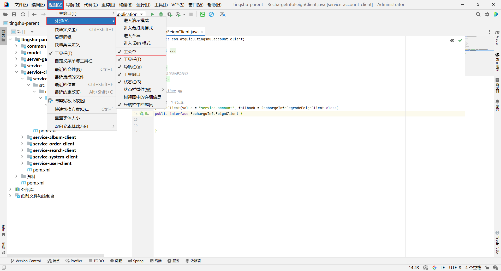
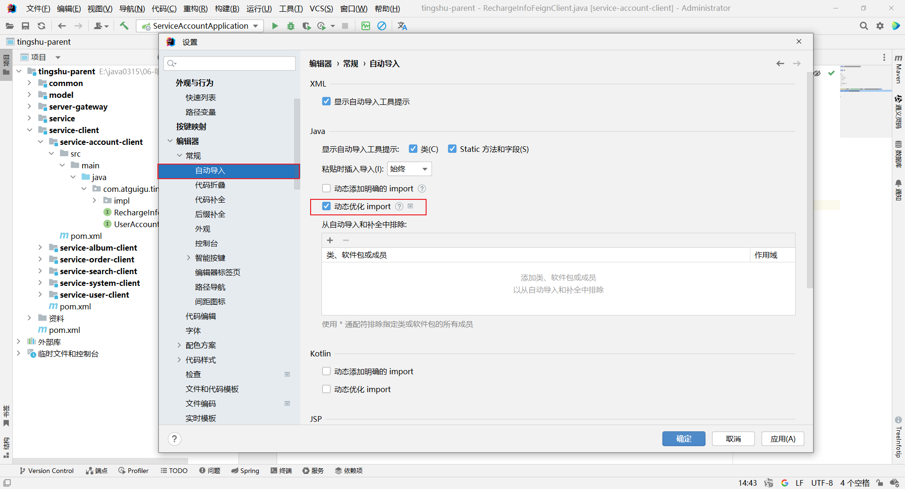
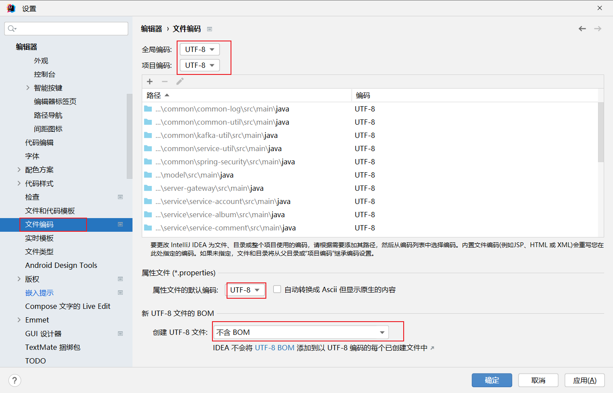
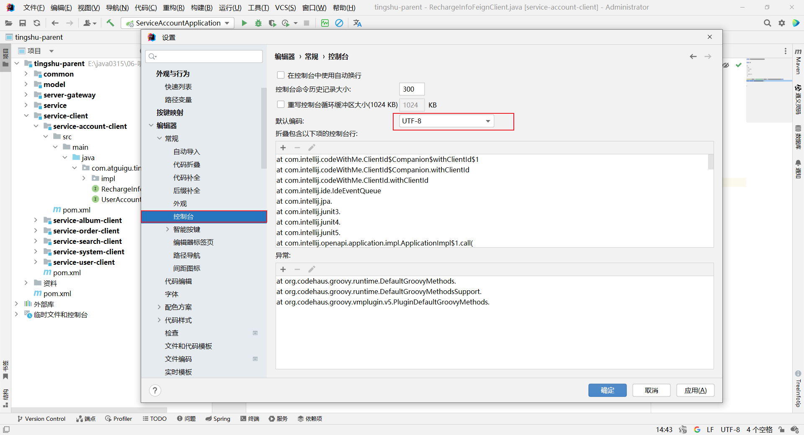
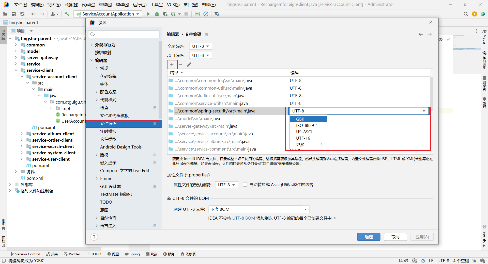

# IDEA设置

## 工具栏

## 自动导包

## 编码设置

### 单独模块,编码设置

## 精选插件

### 推荐1:Alibaba Java Coding Guidelines

编码规范(仅IDEA2022版才有)

### 推荐2:Chinese

中文包

### 推荐3:CodeGlance Pro

右侧缩略图

### 推荐4:maven-search

Maven商店

### 推荐5:Rainbow Brackets Lite - Free and OpenSource(测试)

彩虹括号

### 推荐6:TONGYI Lingma - Your AI Coding Assistant.Type less, Code more.

通义零码

### 推荐5:Translation

翻译

### 推荐5:Treelnfotip

文件夹备注

